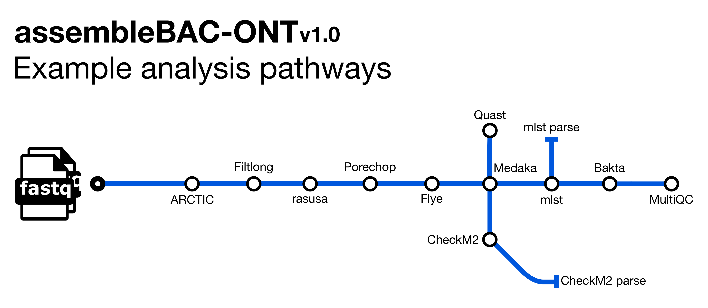

# avantonder/assembleBAC-ONT: Output

## Introduction

This document describes the output produced by the `assembleBAC-ONT` pipeline. The directories listed below will be created in the results directory after the pipeline has finished. All paths are relative to the top-level results directory.

## Pipeline overview

The pipeline is built using [Nextflow](https://www.nextflow.io/) and processes data using the following steps:

- [FastQC](#fastqc) - Raw read QC
- [falco](#fastqc) - Alternative to FastQC for raw read QC
- [Porechop](#porechop) - Adapter removal for Oxford Nanopore data
- [Porechop_ABI](#porechop_abi) - Adapter removal for Nanopore data
- [Filtlong](#filtlong) - Quality trimming and filtering for Nanopore data
- [Nanoq](#nanoq) - Quality trimming and filtering for Nanopore data 
- [Rasusa](#rasusa) - Read downsampling
- [Flye](#flye) - *de novo* genome assembly
- [Medaka](#medaka) - Assembly polishing for Nanopore data
- [mlst](#mlst) - Multi Locus Sequence Type assignment
- [Bakta](#bakta) - Genome annotation
- [CheckM2](#checkm2) - Assembly completeness and contamination
- [Quast](#quast) - General assembly metrics
- [MultiQC](#multiqc) - Aggregate report describing results and QC from the whole pipeline
- [Pipeline information](#pipeline-information) - Report metrics generated during the workflow execution

### FastQC or Falco

Output files

- `{fastqc,falco}/`
  - {raw,preprocessed}
    - `*html`: FastQC or Falco report containing quality metrics in HTML format.
    - `*.txt`: FastQC or Falco report containing quality metrics in TXT format.
    - `*.zip`: Zip archive containing the FastQC report, tab-delimited data file and plot images (FastQC only).

[FastQC](http://www.bioinformatics.babraham.ac.uk/projects/fastqc/) gives general quality metrics about your sequenced reads. It provides information about the quality score distribution across your reads, per base sequence content (%A/T/G/C), adapter contamination and overrepresented sequences. For further reading and documentation see the [FastQC help pages](http://www.bioinformatics.babraham.ac.uk/projects/fastqc/Help/).

If preprocessing is turned on, assembleBAC runs FastQC/Falco twice -once before and once after adapter removal/read merging, to allow evaluation of the performance of these preprocessing steps. Note in the General Stats table, the columns of these two instances of FastQC/Falco are placed next to each other to make it easier to evaluate. However, the columns of the actual preprocessing steps (i.e, fastp, AdapterRemoval, and Porechop) will be displayed _after_ the two FastQC/Falco columns, even if they were run 'between' the two FastQC/Falco jobs in the pipeline itself.

*Falco produces identical output to FastQC but in the `falco/` directory.*

*The FastQC plots displayed in the MultiQC report shows _untrimmed_ reads. They may contain adapter sequence and potentially regions with low quality.*

### Porechop

[Porechop](https://github.com/rrwick/Porechop) is a tool for finding and removing adapters from Oxford Nanopore reads. Adapters on the ends of reads are trimmed and if a read has an adapter in its middle, it is considered a chimeric and it chopped into separate reads.

Output files

- `porechop/`
  - `<sample_id>.log`: Log file containing trimming statistics
  - `<sample_id>.fastq.gz`: Adapter-trimmed file

The output logs are saved in the output folder and are part of MultiQC report.You do not normally need to check these manually.

You will only find the `.fastq` files in the results directory if you provide ` --save_preprocessed_reads`. Alternatively, if you wish only to have the 'final' reads that go into classification/profiling (i.e., that may have additional processing), do not specify this flag but rather specify `--save_analysis_ready_reads`, in which case the reads will be in the folder `analysis_ready_reads`.

**We do **not** recommend using Porechop if you are already trimming the adapters with ONT's basecaller Guppy.**

### Porechop_ABI

[Porechop_ABI](https://github.com/bonsai-team/Porechop_ABI) is an extension of [Porechop](https://github.com/rrwick/Porechop). Unlike Porechop, Porechop_ABI does not use any external knowledge or database for the adapters. Adapters are discovered directly from the reads using approximate k-mers counting and assembly. Then these sequences can be used for trimming, using all standard Porechop options. The software is able to report a combination of distinct sequences if a mix of adapters is used. It can also be used to check whether a dataset has already been trimmed out or not, or to find leftover adapters in datasets that have been previously processed with Guppy.

Output files

- `porechop_abi/`
  - `<sample_id>.log`: Log file containing trimming statistics
  - `<sample_id>.fastq.gz`: Adapter-trimmed file

The output logs are saved in the output folder and are part of MultiQC report.You do not normally need to check these manually.

You will only find the `.fastq` files in the results directory if you provide ` --save_preprocessed_reads`. Alternatively, if you wish only to have the 'final' reads that go into classification/profiling (i.e., that may have additional processing), do not specify this flag but rather specify `--save_analysis_ready_reads`, in which case the reads will be in the folder `analysis_ready_reads`.

### Filtlong

[Filtlong](https://github.com/rrwick/Filtlong) is a quality filtering tool for long reads. It can take a set of small reads and produce a smaller, better subset.

Output files

- `filtlong/`
  - `<sample_id>_filtered.fastq.gz`: Quality or long read data filtered file
  - `<sample_id>_filtered.log`: log file containing summary statistics

You will only find the `.fastq` files in the results directory if you provide ` --save_preprocessed_reads`. Alternatively, if you wish only to have the 'final' reads that go into classification/profiling (i.e., that may have additional processing), do not specify this flag but rather specify `--save_analysis_ready_reads`, in which case the reads will be in the folder `analysis_ready_reads`.

**We do _not_ recommend using Filtlong if you are performing filtering of low quality reads with ONT's basecaller Guppy.**

### Nanoq

[nanoq](https://github.com/esteinig/nanoq) is an ultra-fast quality filtering tool that also provides summary reports for nanopore reads.

Output files

- `nanoq/`
  - `<sample_id>_filtered.fastq.gz`: Quality or long read data filtered file
  - `<sample_id>_filtered.stats`: Summary statistics report

You will only find the `.fastq` files in the results directory if you provide ` --save_preprocessed_reads`. Alternatively, if you wish only to have the 'final' reads that go into classification/profiling (i.e., that may have additional processing), do not specify this flag but rather specify `--save_analysis_ready_reads`, in which case the reads will be in the folder `analysis_ready_reads`.

### Rasusa

[Rasusa](https://github.com/mbhall88/rasusa) randomly subsamples a given read file to a specified coverage. The default is 100X.

Output files

- `rasusa/`
    - `<sample_id>.fastq.gz`: Subsampled read file

### Flye

[Flye](https://github.com/fenderglass/Flye) is a *de novo* assembler for single-molecule sequencing reads, such as those produced by PacBio and Oxford Nanopore Technologies. It is designed for a wide range of datasets, from small bacterial projects to large mammalian-scale assemblies. The package represents a complete pipeline: it takes raw PacBio / ONT reads as input and outputs polished contigs. Flye also has a special mode for metagenome assembly.

Output files

- `flye/`
  - `<sample_id>.flye.log`: log file containing summary statistics
  - `<sample_id>.assembly_graph.gfa.gz`: *de novo* assembly graph file
  - `<sample_id>.assembly.fasta`: *de novo* assembly FASTA file

### Medaka

[Medaka](https://github.com/nanoporetech/medaka) is a tool to create consensus sequences and variant calls from nanopore sequencing data. This task is performed using neural networks applied a pileup of individual sequencing reads against a reference sequence, mostly commonly either a draft assembly or a database reference sequence.

Output files

- `medaka/`
  - `<sample_id>.fa.gz`: zipped, polished *de novo* assembly FASTA file

### mlst

[mlst](https://github.com/tseemann/mlst) scans pubMLST databases to assign Sequence Types (STs) to bacterial isolate genomes.

Output files

- `mlst/`
  - `<sample_id>.tsv`: MLST calls in tsv format
- `metadata/`
  - `mlst_summary.tsv`: MLST summary in tsv format

### Bakta

[Bakta](https://github.com/oschwengers/bakta) is a tool for the rapid & standardized annotation of bacterial genomes and plasmids from both isolates and MAGs.

Output files

- `bakta/`
  - `<sample_id>.gff3`: Annotations & sequences in GFF3 format

### CheckM2

[CheckM2](https://github.com/chklovski/CheckM2) is used for the rapid assessment of genome bin quality using machine learning

Output files

- `checkm2/`
  - `<sample_id>_quality_report.tsv`: CheckM2 output in tsv format
- `metadata/`
  - `checkm2_summary.tsv`: CheckM2 summary in tsv format

### Quast

[Quast](https://quast.sourceforge.net/) is a quality assessment tool for genome assemblies.

Output files

- `metadata/`
  - `transposed_report.tsv`: Quast summary in tsv format

### MultiQC

[MultiQC](http://multiqc.info) is a visualization tool that generates a single HTML report summarising all samples in your project. Most of the pipeline QC results are visualised in the report and further statistics are available in the report data directory.

Output files

- `multiqc/`
  - `multiqc_report.html`: a standalone HTML file that can be viewed in your web browser.
  - `multiqc_data/`: directory containing parsed statistics from the different tools used in the pipeline.
  - `multiqc_plots/`: directory containing static images from the report in various formats.

Results generated by MultiQC collate pipeline QC from supported tools e.g. FastQC. The pipeline has special steps which also allow the software versions to be reported in the MultiQC output for future traceability. For more information about how to use MultiQC reports, see <http://multiqc.info>.

All tools in assembleBAC-ONT supported by MultiQC will have a dedicated section showing summary statistics of each tool based on information stored in log files.

You can expect in the MultiQC reports either sections and/or general stats columns for the following tools:

- fastqc
- porechop
- filtlong
- nanoq
- quast
- bakta

### Pipeline information

Output files

- `pipeline_info/`
  - Reports generated by Nextflow: `execution_report.html`, `execution_timeline.html`, `execution_trace.txt` and `pipeline_dag.dot`/`pipeline_dag.svg`.
  - Reports generated by the pipeline: `pipeline_report.html`, `pipeline_report.txt` and `software_versions.yml`. The `pipeline_report*` files will only be present if the `--email` / `--email_on_fail` parameter's are used when running the pipeline.
  - Reformatted samplesheet files used as input to the pipeline: `samplesheet.valid.csv`.
  - Parameters used by the pipeline run: `params.json`.

[Nextflow](https://www.nextflow.io/docs/latest/tracing.html) provides excellent functionality for generating various reports relevant to the running and execution of the pipeline. This will allow you to troubleshoot errors with the running of the pipeline, and also provide you with other information such as launch commands, run times and resource usage.
